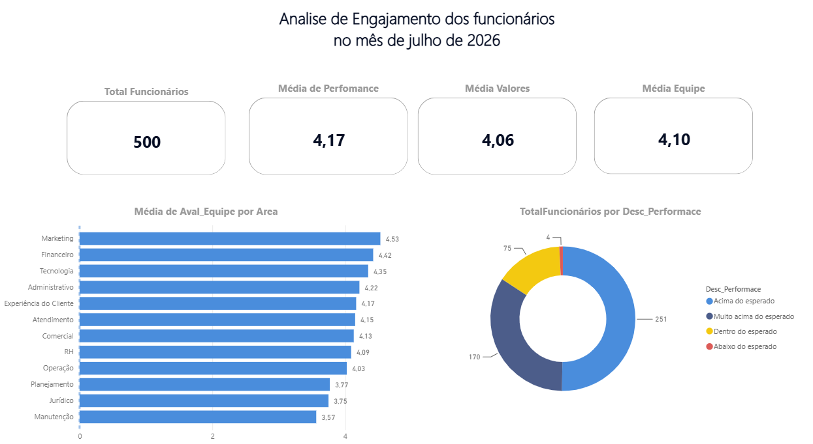
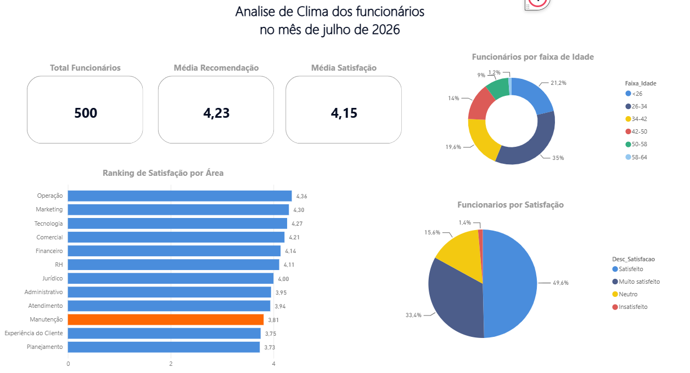

## Projeto de Análise People com Python
Esse projeto foi elaborado como parte de um processo seletivo que estou participando, onde busca compreender
a relação entre as variáveis que impactam tanto no engajamento do funcionário como nas entregas, onde com esses
resultados tornar o ambiente da empresa mais confortável.

## Objetivo:
* Identificar os fatores mais associados à satisfação e ao engajamento dos colaboradores, produzindo recomendações baseadas em dados para apoiar decisões de gestão de pessoas.
* Buscar insights para melhorar o ambiente colaborativo

## Dashboard

Grafico dos dados de engajamento dos funcionários

  

* media avaliacao por equipe 
* Funcionarios por descricao do desempenho

Grafico do dados do clima da organizaçao

  

## Hipoteses
### Quais fatores estão mais associados ao nível de satisfação dos colaboradores?
Antes da exploração dos dados foram levantadas algumas hipóteses que serão verificadas no decorrer da implementação do código
1. Funcionários com maior tempo de empresa apresentam maior nível de satisfação.
2. Existem diferenças significativas de satisfação entre as áreas da empresa.
3. A idade está associada ao nível de satisfação.
4. A probabilidade de recomendar a empresa varia entre os diferentes setores.
5. Existe relação entre satisfação e desempenho.
6. Colaboradores mais satisfeitos tendem a recomendar mais a empresa.

## Metodologia 
1. "Momento Contemplação" (Entendimento do problema): organizar os dados e levantamento das perguntas norteadoras para resolver um problema ou "buscar ele"
2. "Momento Faxina" (Tratamento dos dados): Importar a base de dados e realizar os tratamentos (Verificar nulos, inválidos, vazios, classificação)
3. "Momento Exploração" (EDA): O que posso tirar de proveito desses dados (SQL, Testes Estatísticos, Correlação) e gerar insights
4. "Momento Hacker" (Governança de dados): Criação de mecanismos de segurança para não vazar informação sensívels (Views, Grants, Revoke, ...)
5. "Momento Design": Criar dashboards para apresentação (Power BI, Sheets, Front-end,...)
6. "Momento Palestrante": Apresentar os dados mostrando os resultados e as possíveis estratégias de implementação de resolução de problema

## Indicadores KPI'S
1. Indicadores analisados
2. Índice médio de satisfação
3. eNPS (Employee Net Promoter Score)
4. Distribuição de satisfação por área
4. Distribuição de satisfação por tempo de empresa
5. Correlação entre satisfação e desempenho
6. Taxa de recomendação por setor

## Insights Esperados
1. Quais áreas apresentam menor satisfação?
Respostas: 

A análise das médias de satisfação por área mostrou que os menores índices foram encontrados em:
* Planejamento
* Experiência do Cliente
* Manutenção
Entre elas, Manutenção foi destacada no dashboard por apresentar um dos menores níveis de satisfação e representar um grupo que merece atenção da gestão.

2. O tempo de empresa influencia o engajamento?
Respostas: 

Durante a análise, foi observado que colaboradores com maior tempo de empresa mantiveram bons níveis médios de satisfação e recomendação da empresa.
Entretanto, com os dados disponíveis não é possível afirmar uma relação de causa e efeito entre tempo de empresa e engajamento. Para confirmar essa influência seriam necessárias análises estatísticas adicionais, como correlação ou testes de hipótese.

3. Existem grupos que demandam maior atenção da liderança?
Respostas:

Sim.

Os dashboards indicaram que a área de Manutenção apresentou resultados inferiores às demais em indicadores relacionados à satisfação.

Por esse motivo, recomenda-se que essa equipe seja priorizada em futuras análises qualitativas para compreender possíveis fatores associados ao resultado, como:

comunicação interna;
liderança;
carga de trabalho;
oportunidades de desenvolvimento;
reconhecimento profissional.

Em contrapartida, áreas como Operação, Marketing e Tecnologia apresentaram os maiores índices de satisfação.

4. Quais fatores parecem contribuir para maior recomendação da empresa?
Respostas:
Os dados sugerem que áreas com melhores avaliações em:

trabalho em equipe;
desempenho;
alinhamento com os valores da organização;

também apresentaram maiores índices de satisfação e recomendação da empresa.

Embora a base não permita estabelecer causalidade, esses indicadores apontam que um ambiente colaborativo e equipes bem avaliadas tendem a estar associados a níveis mais elevados de recomendação.

5. Quais ações podem melhorar a experiência do colaborador?
Respostas:
Com base na análise realizada, algumas ações podem contribuir para a melhoria da experiência dos colaboradores:

realizar entrevistas e pesquisas qualitativas na equipe de Manutenção;
acompanhar continuamente os indicadores de satisfação por área;
compartilhar boas práticas das áreas com melhores resultados;
fortalecer programas de reconhecimento e desenvolvimento profissional;
utilizar dashboards para monitoramento contínuo dos indicadores de clima organizacional.

## Principais Insights
* A empresa apresentou um clima organizacional positivo, com média geral de satisfação superior a 4 pontos.
* A área de Operação apresentou o melhor desempenho em satisfação entre as áreas com maior número de colaboradores.
* A área de Manutenção apresentou um dos menores índices de satisfação, tornando-se prioridade para futuras investigações.
* Os indicadores de desempenho, trabalho em equipe e alinhamento aos valores permaneceram elevados na maior parte da organização.
* A utilização integrada de Python, SQL e Power BI permitiu automatizar o processo de análise e gerar informações para apoiar decisões estratégicas, porem necessita mais alguns ajustes.

## Tecnologias Utilizadas
1. Google Sheets
2. Python (Pandas, Numpy,)
3. SQL(SQLite)
4. Power BI (Dashboard)
5. OBS Studio